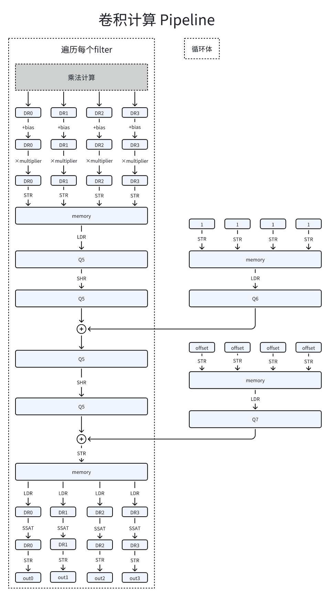
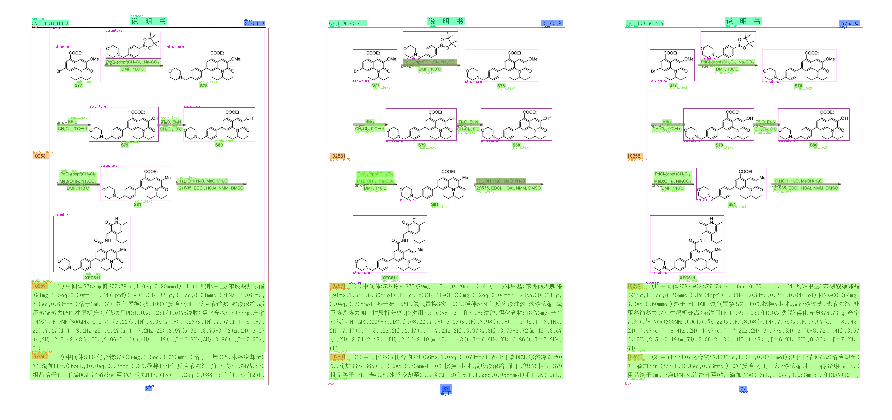
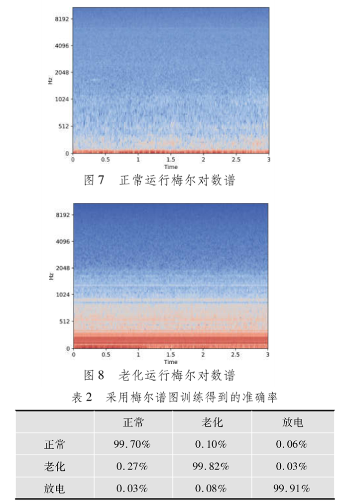
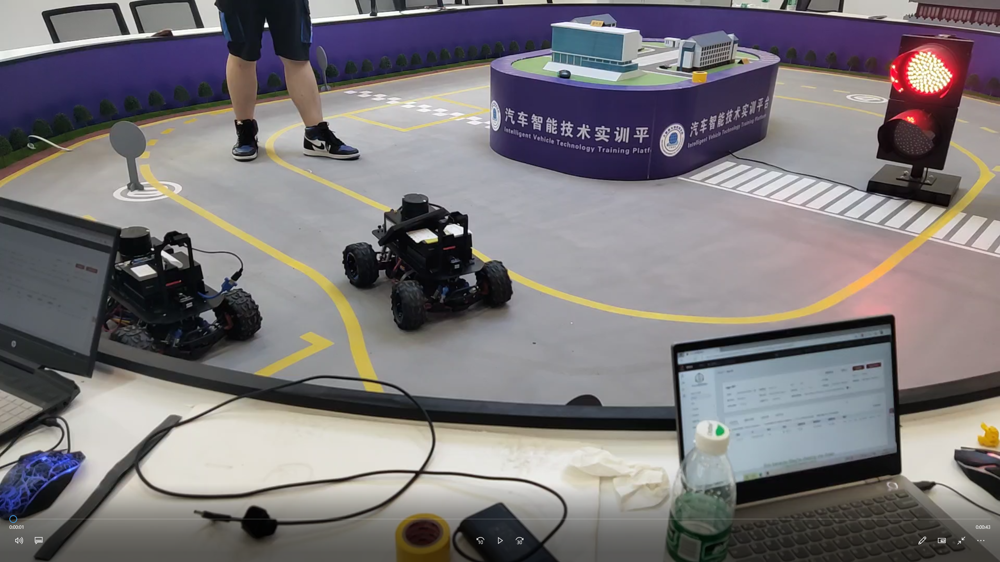
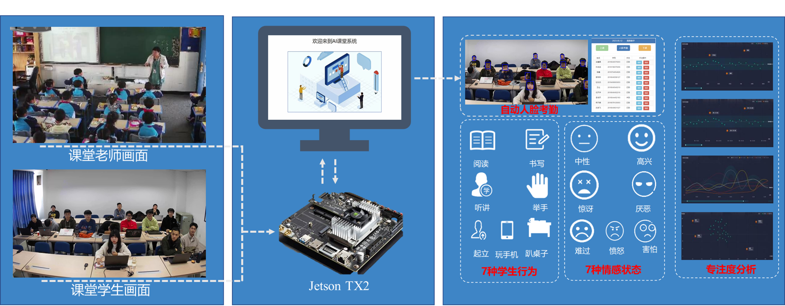
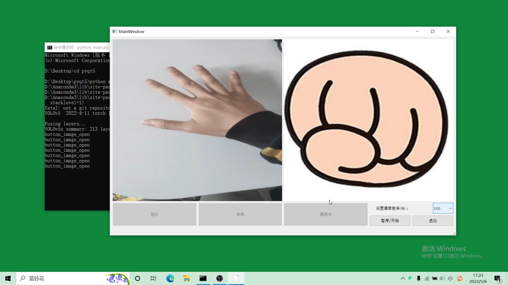
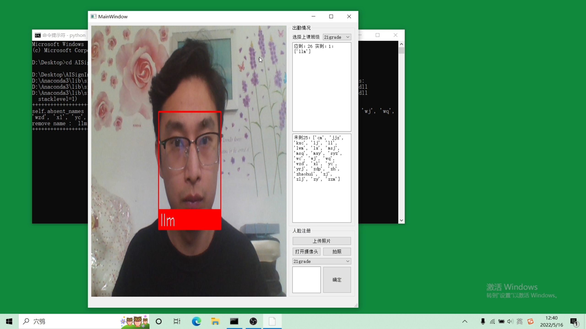

# 你好，我是 刘力铭 👋

🎯 **算法工程师**  
📍 **现职**：青鸟消防 AI 软件工程师  
📚 **教育背景**：北京联合大学 软件工程（硕士）  

---

## 🔥 个人简介  
- 📌 **研究方向**：深度学习、嵌入式 AI、计算机视觉  
- 🏆 **科研成果**：专利 1 项，软件著作权 2 项，核心论文 2 篇  
- 💡 **工作经验**：计算机视觉、AI 软硬件优化、模型推理加速、ARM 汇编优化  

📫 **联系我**：
- 📞 电话：13161112567  
- 📧 邮箱：[754635109@qq.com](mailto:754635109@qq.com)  

---

## 🏢 工作经历  

### **🔹 青鸟消防 - AI 软件工程师（2024.06 - 至今）**  
  
- 负责 **ARM Cortex-M0 MCU** AI模型推理库优化，推理速度相较 Google 方案提升 **70%**  
- 负责 **MVE 向量架构 NPU** 卷积算法汇编代码编写，优化推理速度 **提升 20-40 倍**  
- 负责 **故障电弧检测、探头报警** AI算法模型转换成 **TFlite** 部署到嵌入式平台  

### **🔹 燧坤智能科技有限公司 - 算法实习生（2023.11 - 2024.06）** 
 
- 负责 **Cascade-dit** 和 **Layoutlm-V3** 版面检测模型训练、优化，提取论文专利中的关键信息  
- 进行 **医学病理数据分析**，统计变量分布，建立变量相关性关系，使用逻辑回归分析风险因素  
- 设计并优化 **数据处理流水线**，提高数据处理效率，提升模型训练效果

---

## 📌 项目经历   

### 🔹 **基于深度学习的变压器故障检测**  

- 采集变压器声音数据（正常/老化/故障），清理数据并构建分类数据集  
- 将音频转换为频谱图像，并使用 MobileNet 训练分类模型  
- **最终分类准确率超过 90%**  

### 🔹 **华为 Hilens 端侧设备 AI 开发**  （点击封面可观看 Bilibili 视频）
 
- 部署 **YOLOv3** 目标检测算法至 Hilens 端侧设备  
- 移植 **ROS 机器人操作系统**，实现目标检测与自动导航  
- 端侧 AI 推理优化，减少计算开销并提升性能  

### 🔹 **智能课堂分析系统**  

- 采用 **RetinaFace** 进行人脸识别，实现自动考勤功能  
- 结合 **LSTM** 网络，分析头部姿态、面部表情，评估学生专注度  
- 运行于 **NVIDIA Jetson TX2** 开发板，优化推理性能  
- 模型量化转换 **Torch >> ONNX >> TensorRT**

---
## 🚀 作品展示（点击封面可观看 Bilibili 视频）  
 
### 📌 1. **可调胜率猜拳系统**  
  
> **描述**：基于 RetinaFace 进行人脸识别考勤，LSTM 评估学生专注度  
> **技术栈**：PyTorch, RetinaFace, LSTM, NVIDIA Jetson TX2  

### 📌 2. **人脸识别签到系统**  
  
> **描述**：优化 MCU 推理库，推理速度提升 70%  
> **技术栈**：ARM 汇编, Cortex-M0, 计算优化  

---

## 🛠 技能栈  

- **编程语言**：Python（精通），C（熟练）  
- **AI 框架**：PyTorch, TensorFlow, Sklearn  
- **深度学习**：CNN, LSTM, YOLO, MobileNet  
- **嵌入式开发**：ARM 汇编, MCU, NPU 加速, Jetson TX2  
- **工具链**：Linux, Git, OpenCV, Pandas, Numpy  

---

## 📊 GitHub 统计  

---

🎯 **如果你对我的项目感兴趣，欢迎 Star & Follow！**
